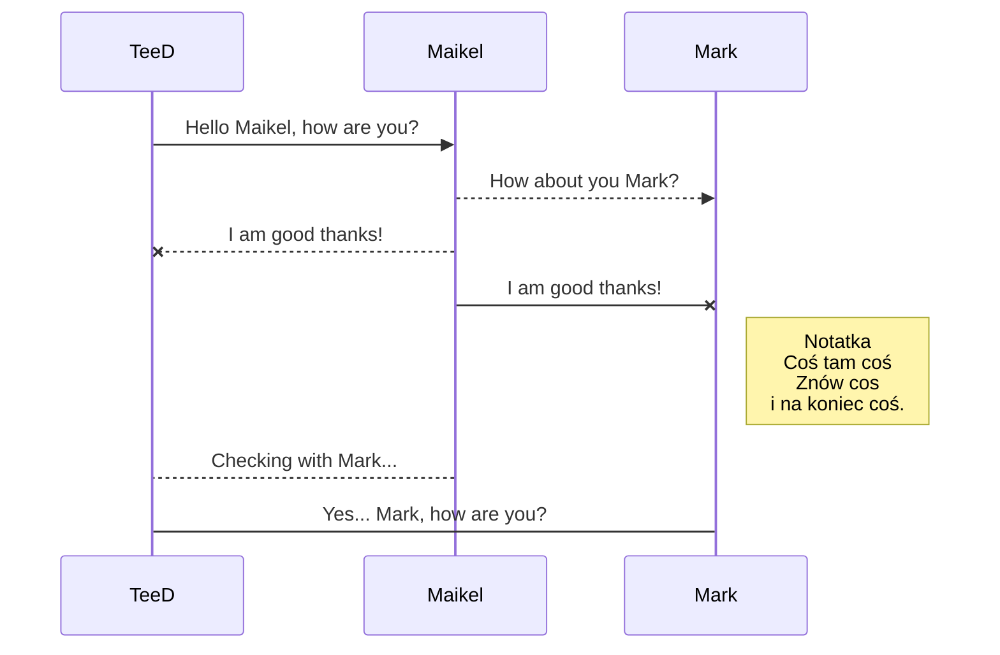
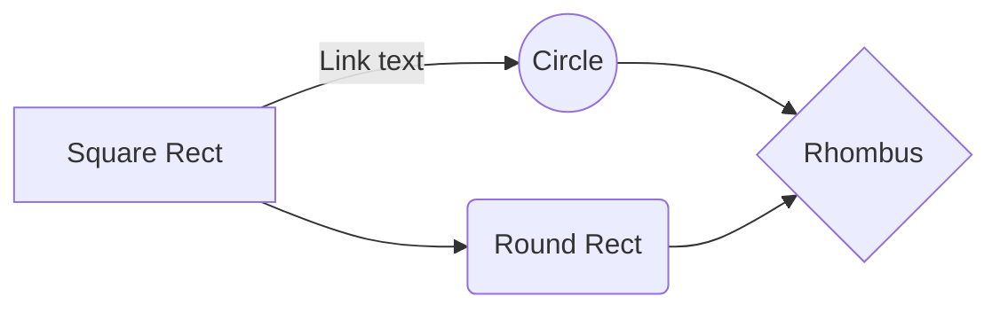

# upa_usb_s_test
> Testowe plik
Start 11-04-2023 godzina 19.00
## Przykłady...
- jeden odnośnik 
- drugi odnośnik
Przykład linku [TeeD'Ex](https://teedex.eu/forum/). 

**Przykład diagramu:**

*Przykład przepływów:*

