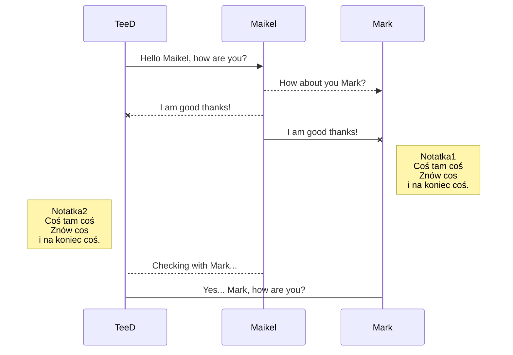
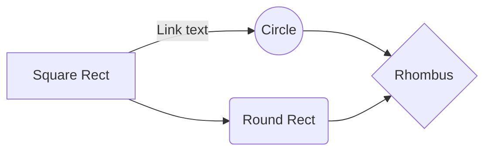

# upa_usb_s_test
> Testowe plik 
Start 11-04-2023 godzina 19.00
## Przykłady 1...
- jeden odnośnik 
- drugi odnośnik

## Przykłady 2...
1. jeden odnośnik 
2. drugi odnośnik

## Przykłady 3...
-[Coś tam coś] jeden odnośnik 
-[ nie tak ] drugi odnośnik

## kolorowanie
`Info w kawdracie`

Link do zdjęcia

Przykład linku [TeeD'Ex](https://teedex.eu/forum/) 

~~cos przekreślonego~~
~cos przekreślonego~
**Przykład diagramu:**

*Przykład przepływów:*

